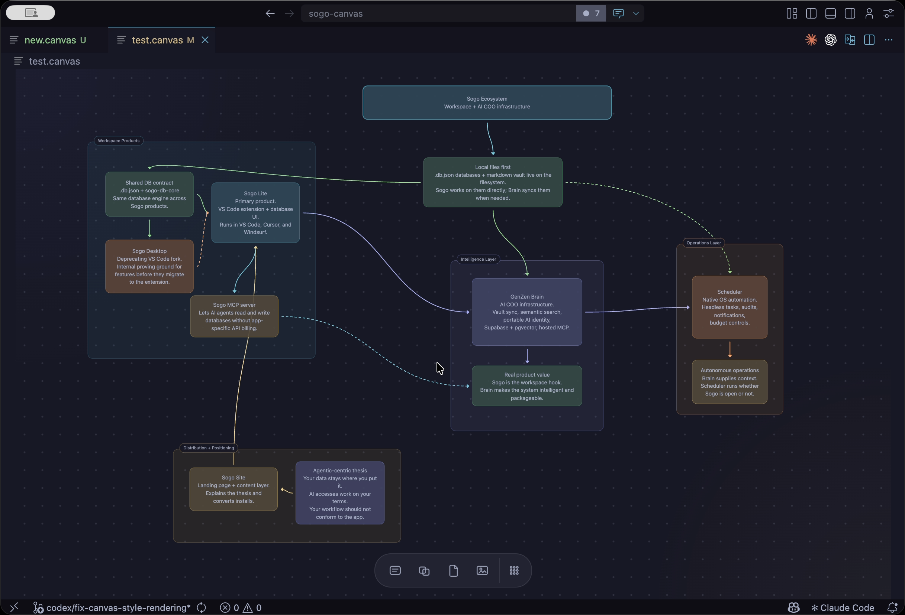
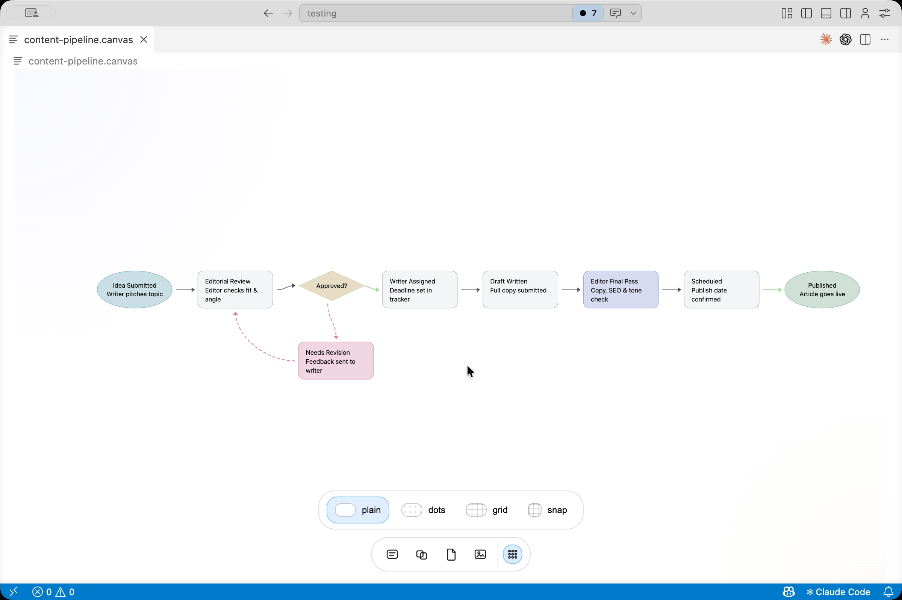
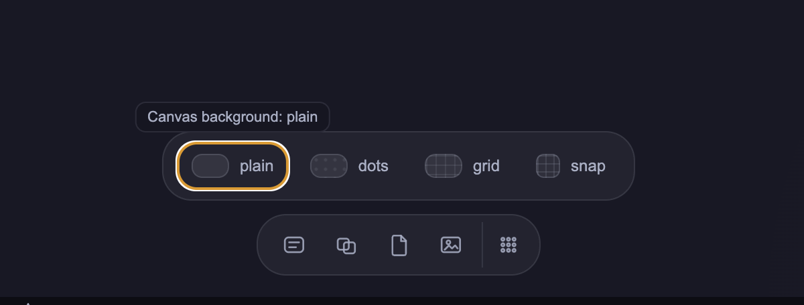

# Sogo Canvas

A theme-native infinite canvas for VS Code. Open `.canvas` files and you get a full canvas editor inside the editor — text cards, groups, connectors, file references, and image references. Everything saves back to plain JSON you can inspect, diff, and generate.



## Why this exists

Most VS Code canvas tools work, but they feel imported. Sogo Canvas reads your active theme's color tokens directly, so the surface adapts whether you're in a dark theme, a light theme, or something custom. The interaction model stays small: a few node types, a small toolbar, and canvas settings that live in the file.



## Getting started

Open any `.canvas` file and the custom editor loads automatically. To start fresh, run **Sogo Canvas: New Canvas** from the Command Palette (`Cmd+Shift+P` / `Ctrl+Shift+P`).

A sample canvas (`test.canvas`) is included in the repo if you want to see a populated document before building your own.

## Using the canvas

### Adding nodes

Double-click any empty area of the canvas to insert a text card. The toolbar at the bottom of the canvas gives you access to all node types: text cards, groups, file references, and image references.

### Editing text

Double-click a text card or group to edit it inline. You can also press `Enter` while a node is selected.

### Connecting nodes

Drag from any handle on the edge of a node to another node to create a connector. Connectors support color, dashed or solid line style, and optional arrowheads. To change connector appearance, select the connector and use the toolbar options that appear.

### Selecting multiple nodes

Click and drag over empty space to marquee-select a region. Once you have multiple nodes selected, you can move them together or wrap them in a group.

### Removing nodes and connectors

Select any node or connector and press `Delete` or `Backspace`.

### Canvas background and snap



The background tray at the bottom of the canvas lets you switch between plain, dot, and grid backgrounds, and toggle snap-to-grid on or off. Your current background choice and viewport position are saved into the document.

## File format

`.canvas` files are JSON with three top-level sections:

```json
{
  "nodes": [],
  "edges": [],
  "sogo": {
    "background": "dots",
    "snapToGrid": false,
    "viewport": {
      "x": 0,
      "y": 0,
      "zoom": 1
    }
  }
}
```

**Node types:** `text`, `group`, `file`, `image`

Each node stores position, size, styling metadata, and any text content or file path. Each edge stores the source and target node IDs, handle sides, color, line style, and arrowhead state.

Because the format is plain JSON, you can create or modify `.canvas` files programmatically, check them into version control, and diff them like any other document.

## Development setup

**Requirements:** Node.js 20+, VS Code 1.89+

```bash
npm install
npm run build
```

To run with live reloading:

1. Open the repo in VS Code.
2. Run `npm install` once if you haven't already.
3. Run `npm run watch` to keep the build current.
4. Open the Run and Debug panel and start the extension host.

Changes to the webview source in `/webview` rebuild on save. Extension host changes in `/extension` require restarting the extension host.

To type-check without building:

```bash
npm run typecheck
```

## Repository layout

- `/extension` — VS Code extension host code and packaged webview assets
- `/webview` — React canvas UI, built with Vite

## Packaging and publishing

The publishable extension lives in `/extension`.

```bash
cd extension
npx @vscode/vsce package    # produces a .vsix
npx @vscode/vsce publish    # publishes to VS Code Marketplace
```

A few things worth knowing before you publish:

- The VS Code Marketplace does not allow SVG extension icons. The packaged icon is `extension/icon.png`, generated from the source SVG at the root.
- Marketplace publishing also rejects SVG images inside README content. Any screenshots you embed should be HTTPS-hosted PNG or JPG files.

## Status

Version `0.0.1`. Early release. No automated test suite yet. License is currently `UNLICENSED`.
